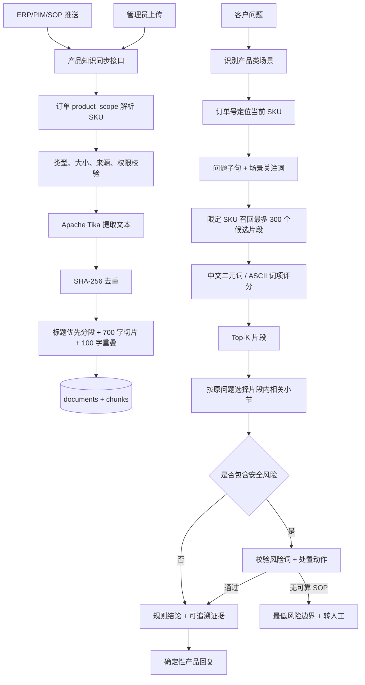
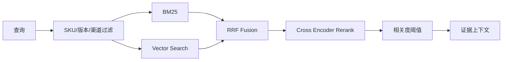

# SupportOps Agent RAG 检索策略

> 更新日期：2026-07-30。本版同步跨 SKU 安全隔离、片段内小节聚焦和确定性产品回复机制。

## 1. 目标与边界

SupportOps Agent 的 RAG 用于回答与具体 SKU 相关的产品问题，例如：

- 产品规格、功能、尺寸、材质、续航、防水和兼容性；
- 安装、连接、配对、充电、清洁、保养和使用步骤；
- 无法开机、无法充电、异常发热、报错和售后排查。

RAG 不负责查询订单金额、支付状态、退款进度和物流节点。这类信息是实时结构化业务事实，应由受控 DAO/Service 直接查询业务库。两类数据最终都被转换成统一的 `DiagnosisEvidence`。普通事实场景可以交给回复模型组织语言，产品使用和产品故障/售后场景则直接返回规则层的确定性答案。

> 当前实现是一个按 SKU 隔离的轻量级 RAG 基线，采用文档解析、分块和词项相关度排序，尚未接入 Embedding 模型或向量数据库。仓库中的 MySQL Full-Text 索引已经预留，但当前检索代码仍在应用层完成排序。

## 2. 总体流程



## 3. 数据来源与权限

支持两类来源：

| 来源 | `source_type` | 说明 |
| --- | --- | --- |
| ERP 同步 | `ERP` | 模拟 ERP/PIM/SOP 中心推送，必须携带外部文档编号 `sourceReference` |
| 管理员上传 | `MANUAL` | 管理员在订单与产品模块手动补充资料 |

仅 `ADMIN` 可以管理产品知识附件。接口不会信任客户端自报角色，并且 ERP 同步入口会在服务端把来源固定为 `ERP`，防止普通上传伪装为外部同步。

主要接口：

| 方法 | 路径 | 用途 |
| --- | --- | --- |
| `GET` | `/api/v1/admin/orders/{orderNo}/knowledge-documents` | 查询订单对应 SKU 的资料 |
| `POST` | `/api/v1/admin/orders/{orderNo}/knowledge-documents` | 管理员上传并索引 |
| `GET` | `/api/v1/admin/orders/{orderNo}/knowledge-documents/{id}/download` | 下载原始附件 |
| `DELETE` | `/api/v1/admin/orders/{orderNo}/knowledge-documents/{id}` | 删除附件及级联片段 |
| `POST` | `/api/v1/admin/integrations/erp/sync/product-knowledge` | 模拟 ERP 推送资料 |

## 4. 文档摄取策略

### 4.1 SKU 定位

接口接收 `orderNo`，服务端查询 `biz_orders.product_scope` 并解析首个空格前的内容作为 SKU。例如：

```text
SKU-A018 智能耳机 Pro
```

会得到：

```text
productSku = SKU-A018
productName = 智能耳机 Pro
```

文档始终绑定 SKU，而不是只绑定订单。这样同一 SKU 的多个订单可以共享同一知识库，同时避免不同产品之间相互召回。

### 4.2 文件限制

- 单文件最大 10 MB；
- 最大提取文本长度 200,000 字符；
- 支持 Apache Tika 可解析的 PDF、Word、TXT、Markdown 和常见办公文档；
- 文档类型白名单：`PRODUCT_MANUAL`、`SPECIFICATION`、`USAGE_GUIDE`、`TROUBLESHOOTING`、`AFTER_SALES_SOP`、`FAQ`、`OTHER`；
- 原始文件名会移除路径，只保留安全文件名；
- 使用 `SHA-256` 计算校验值，同一 SKU 下内容完全相同的附件拒绝重复索引。

### 4.3 文本标准化

文本提取后会执行：

- 移除空字符；
- 归一化制表符、回车和连续空格；
- 压缩过多空行；
- 去除首尾空白；
- 超过长度上限时截断。

数据库同时保存原始二进制、提取文本、版本、来源、校验值和索引状态，便于下载、审计和重新索引。

### 4.4 分块策略

当前参数：

```text
CHUNK_SIZE = 700 characters
CHUNK_OVERLAP = 100 characters
```

分块优先级：

1. Markdown 文档优先按 `#` 至 `######` 标题切成语义章节；
2. 章节仍过长时按 700 字切分；
3. 在窗口末尾附近优先寻找换行或中文句号作为边界；
4. 相邻片段保留 100 字重叠，降低步骤或说明被切断的概率。

这是一种可解释、成本较低的基础方案。对于表格密集 PDF、扫描件、复杂 Word 和跨页步骤，生产环境应进一步增加 OCR、布局解析和表格结构保留。

## 5. 查询构造与召回

### 5.1 场景限定

只有以下场景会进入产品知识检索：

- `PRODUCT_INFORMATION_QUERY`
- `PRODUCT_USAGE_GUIDANCE`
- `PRODUCT_TROUBLESHOOTING`

订单、支付、退款、物流等场景不会扫描产品附件。

### 5.2 查询扩展

系统先从客户原问题中提取与当前产品场景相关的子句，再追加一组稳定的场景关注词：

| 场景 | 关注词示例 |
| --- | --- |
| 产品信息 | 规格、参数、功能、兼容、防水、续航、材质、尺寸 |
| 使用指导 | 使用、安装、连接、配对、操作、保养、清洁、说明书 |
| 故障排查 | 故障、排查、无法开机、发热、异味、鼓包、冒烟、漏液、漏电、短路、安全、售后 |

例如客户输入：

```text
这款耳机防水吗？怎么连接新手机？订单什么时候送到？
```

产品信息检索只保留与“防水”相关的子句，使用指导检索只保留与“连接”相关的子句；物流问题由物流 Handler 单独查询，避免不同意图互相污染检索词。

### 5.3 候选范围

召回前必须完成两层过滤：

1. 当前订单关联的 `productSku`；
2. 文档 `index_status = INDEXED`。

DAO 最多读取当前 SKU 最新的 300 个片段，避免无上限扫描。

### 5.4 片段内小节聚焦

Top-K 只是文档片段级召回。为了避免一个较长片段同时包含规格、连接、故障和售后内容，`ProductKnowledgeHandlerSupport` 会再按客户原问题进行一次小节选择：

1. 按 Markdown 标题切分召回片段；
2. 从问题中提取稳定业务词和中文二元词；
3. 对小节计算命中分；
4. 普通问题保留最高分的一个小节；
5. 安全问题最多保留两个相关小节，防止停止使用和后续售后动作被拆开；
6. 证据中只保存聚焦后的小节，不再把整份说明书送入回复上下文。

该步骤不会突破 SKU 过滤边界，也不会从其他产品文档补齐当前产品缺失的内容。

## 6. 当前相关度算法

查询会被拆成两类词项：

- ASCII 词项：型号、接口名、版本号等，例如 `ipx5`、`usb-c`、`android`；
- 中文词项：移除非汉字字符后构造连续二元词，例如“防水等级”产生“防水”“水等”“等级”。

同时移除“这个、那个、产品、商品、请问、一下、怎么、如何、可以、是否”等低信息量词项。

每个片段的基础分数为各词项命中分之和：

```text
termScore = weight(term.length) × min(occurrenceCount, 4)
weight = 2.0 when term.length >= 3, otherwise 1.0
```

结果按以下顺序排序：

1. `relevance` 降序；
2. `documentId` 升序；
3. `chunkIndex` 升序。

`topK` 当前为：

- 产品信息：1；
- 使用指导：1；
- 故障排查：2；
- Service 层允许范围：1～8。

这种算法实现简单、可解释、无需额外模型，但对同义词、长距离语义、错别字和跨语言问题的处理能力有限。因此文档中应称为“轻量词项检索 RAG”，不要误称为已经完成向量语义检索。

## 7. 证据生成与回答约束

召回片段不会直接无条件拼接给客户。处理流程为：

1. `ProductKnowledgeHandlerSupport` 按客户原问题聚焦片段内相关小节；
2. 每个有效小节生成一条 `DiagnosisEvidence`，保存 SKU、文档类型、文档名和片段序号；
3. 普通产品问题仅使用这些证据生成规则答复，不用模型常识补齐产品参数；
4. 产品使用和产品故障/售后场景由 `DiagnosisTaskProcessor` 直接采用规则答复，不再交给回复模型二次改写；
5. 未命中文档时明确拒绝猜测，并要求补充型号、现象或转人工。

### 7.1 安全风险验证

安全风险词覆盖发热、过热、烫手、异味、焦味、鼓包、膨胀、冒烟、起火、爆炸、爆裂、漏液、漏电、触电、进水、短路和火花等现象，不依赖产品名称。

当前 SKU 的召回内容必须同时满足两个条件，才允许作为产品专属安全步骤：

- 包含至少一个可识别的风险现象；
- 包含停止、断开、断电、切断、禁止、远离、联系、检测、送检或送修等明确处置动作。

若没有通过验证的安全 SOP，系统只提供跨产品的最低风险边界：立即停止使用；仅在无需接触异常部位且能够确保人身安全时断开电源或停止充电；不继续测试、充电、挤压、拆机或用水处理；让人员远离并联系人工客服或品牌售后。已经冒烟、起火或无法安全处置时，提示联系当地消防或紧急服务。

该兜底不会输出容量、复位、拆卸、维修或退换承诺，也不会从耳机、充电宝等其他 SKU 借用处置步骤。

## 8. 数据模型

### `product_knowledge_documents`

保存：

- `product_sku`
- 文档类型与来源
- ERP 外部引用编号
- 文件名、MIME、大小和版本
- `checksum_sha256`
- `extracted_text`
- 原始 `file_content`
- `index_status`
- 同步时间、创建人和错误信息

### `product_knowledge_chunks`

保存：

- `document_id`
- `chunk_index`
- `chunk_text`
- `character_count`

文档删除时片段通过外键 `ON DELETE CASCADE` 自动清理。

## 9. 失败处理

| 失败情况 | 系统行为 |
| --- | --- |
| 订单不存在 | 返回 `RESOURCE_NOT_FOUND` |
| 订单没有 SKU | 拒绝建立产品知识索引 |
| 文件过大或为空 | 返回参数错误 |
| Tika 无法提取文本 | 提示更换可解析文档 |
| 同 SKU 内容重复 | 通过 SHA-256 唯一约束拒绝 |
| 当前 SKU 无命中 | 不使用大模型常识，返回缺少依据并建议澄清或人工核实 |
| 回复模型不可用 | 保留规则生成的事实回复，任务进入安全降级 |
| 安全问题无可靠 SOP | 返回最低风险边界并转人工，不生成产品专属步骤 |
| 召回内容只有风险词、没有处置动作 | 不视为可用安全 SOP，不对客输出具体操作 |
| 产品使用或售后规则已生成答案 | 跳过回复模型，防止事实被扩写或安全动作被遗漏 |

## 10. 安全注意事项

- 生产环境不建议长期把原始附件保存在 MySQL `LONGBLOB`；可迁移到对象存储，数据库只保存地址、哈希和元数据。
- 文档内容属于不可信输入。生产版应增加文件病毒扫描、宏清理、压缩炸弹检测、OCR 资源限制和 Prompt Injection 检测。
- 不要把附件中的“忽略系统提示”等文本当成指令。文档只能作为事实候选，不能改变系统 Prompt、权限或工具计划。
- 产品资料需要租户、渠道、地区、语言和版本生效范围时，必须在召回前进行元数据过滤。
- 下载接口应继续执行角色校验、订单到 SKU 校验和安全文件名处理。
- 安全 SOP 必须有明确适用 SKU、版本和生效范围；不得把“相似产品经验”作为当前产品证据。
- 产品知识证据只保留客户问题相关小节，减少无关参数和内部说明进入生成上下文。

## 11. 评测建议

建议建立一个独立的 RAG 测试集，每条样本至少包含：

```json
{
  "sku": "SKU-A018",
  "question": "这款耳机能戴着游泳吗？",
  "expectedDocument": "SKU-A018-product-manual.md",
  "expectedFacts": ["IPX5", "不可浸水"],
  "mustNotContain": ["支持游泳"]
}
```

重点指标：

- Recall@K：正确片段是否被召回；
- MRR / nDCG：正确片段排序是否靠前；
- Groundedness：回复中的事实是否都能在证据中找到；
- Answer Completeness：多问题是否逐项回答；
- Refusal Accuracy：资料不足时是否正确拒答；
- Version Conflict Accuracy：版本冲突时是否说明冲突而非擅自选边。
- Cross-SKU Leakage：回复是否出现其他 SKU 的产品名、参数或处置步骤；
- Safety Recall：漏电、漏液、冒烟、火花等风险是否稳定进入安全分支；
- Safety Action Preservation：当前 SKU SOP 中停止、断电、送检、转人工等关键动作是否完整保留；
- Safe Fallback Accuracy：缺少安全 SOP 时是否只给最低风险边界且没有编造专属步骤。

本轮回归至少覆盖以下产品差异：耳机、充电宝、缺少安全资料的未知产品、电饭煲漏电、玩具电池漏液、显示器冒烟和台式设备火花。当前自动化验证结果为 16/16 通过。

## 12. 向量化升级路线

推荐按以下顺序演进：

1. 把 `ProductKnowledgeService.retrieveForOrder` 抽象为 `ProductKnowledgeRetriever` 接口；
2. 保留当前词项检索作为 `LexicalRetriever` 和无外部服务兜底；
3. 文档入库时生成 Embedding，写入 pgvector、Milvus、OpenSearch 或 Elasticsearch；
4. 同时执行 BM25/全文检索与向量召回；
5. 使用 Reciprocal Rank Fusion 合并候选；
6. 对 Top-N 使用 Reranker 重排；
7. 再根据 SKU、版本、地区、渠道和时间进行硬过滤；
8. 只有通过阈值的片段才能进入生成上下文。

推荐的生产检索链路：



## 13. 关键代码位置

| 职责 | 文件 |
| --- | --- |
| 上传、解析、分块、评分与召回 | `src/main/java/com/example/supportops/module/knowledge/service/ProductKnowledgeService.java` |
| 文档和片段数据库访问 | `src/main/java/com/example/supportops/module/knowledge/dao/ProductKnowledgeDAO.java` |
| 管理员附件接口 | `src/main/java/com/example/supportops/module/knowledge/controller/AdminProductKnowledgeController.java` |
| ERP 同步接口 | `src/main/java/com/example/supportops/module/knowledge/controller/ErpProductKnowledgeSyncController.java` |
| 场景查询编排 | `src/main/java/com/example/supportops/module/diagnosis/application/DiagnosisContextFactory.java` |
| 产品知识规则与证据 | `src/main/java/com/example/supportops/module/diagnosis/handler/ProductKnowledgeHandlerSupport.java` |
| 确定性回复与复合问题编排 | `src/main/java/com/example/supportops/module/diagnosis/application/DiagnosisTaskProcessor.java` |
| 安全场景关键词兜底 | `src/main/java/com/example/supportops/module/ai/fallback/KeywordFallbackClassifier.java` |
| 回复模型脱敏上下文 | `src/main/java/com/example/supportops/module/ai/reply/VerifiedReplyContextBuilder.java` |
| 数据表 | `sql/schema.sql`、`sql/portal-schema.sql` |
