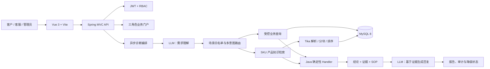

# SupportOps Agent｜智能工单诊断与客服协同平台

SupportOps Agent 是一个面向电商售后场景的全栈智能客服项目。它能够理解客户在订单上下文中的真实需求，查询订单、支付、退款、物流和产品资料等可信数据，执行确定性诊断规则，并生成带证据、可审计、可降级的中文客服回复。

项目没有把大模型当作“可任意查询数据库的万能代理”。大模型只负责需求理解和语言组织；业务事实查询、权限校验、场景路由、规则判断和证据保存全部由后端受控代码完成。这种设计兼顾了智能体验、业务准确性和可解释性。

> 当前仓库是 Spring Boot 后端。Vue 3 前端工程名为 `fin-ai-vue-home`。


## 项目亮点

- **多意图理解**：一句话可以同时识别金额、物流、产品规格、使用方法和故障排查等多个需求，并逐项回答。
- **事实驱动的 Agent 工作流**：模型做理解与表达，Java Handler 做受控查询和确定性判断，避免模型直接生成 SQL 或编造业务事实。
- **产品知识 RAG**：支持 ERP 模拟同步或管理员上传产品说明书、规格书、FAQ、售后 SOP；按订单关联 SKU 召回片段并形成证据。
- **可解释诊断**：保存理解、查询、规则、回复、报告等步骤，记录证据来源、置信度、SOP 和模型调用审计。
- **安全降级**：模型超时、限流、额度耗尽或结构化输出失败时，保留规则引擎结果并使用安全模板；JSON 解析失败支持一次格式纠错重试。
- **三角色权限体系**：客户、客服人员、系统管理员拥有独立的数据范围、工作台和接口权限。
- **人工与智能体协同**：支持客户转人工、返回智能体、消息附件、1 分钟内撤回、会话归档和客服侧智能建议。
- **业务闭环**：包含订单与产品、物流、售后工单、退款审批、消息中心、人员管理、审计日志和数据看板。
- **外部系统预留**：提供 ERP 产品知识同步入口，并为 ERP、WMS、物流、会员、监控和工单平台保留适配配置。

## 核心架构



一次诊断的主链路如下：

1. 创建异步诊断任务并返回 `diagnosisId`。
2. 大模型将客户问题转换为结构化 `TicketIntent`，支持多个 `scenarioTypes`。
3. 后端只执行场景白名单中预先注册的查询计划。
4. Java Handler 根据真实业务快照或 RAG 片段生成规则结论和证据。
5. 回复模型只接收脱敏后的客户问题、已识别需求、验证事实、结论和 SOP。
6. 结构化回复通过 Bean Validation 后保存；失败时纠错重试或安全降级。

详细设计见：

- [RAG 检索策略](RAG检索策略.md)
- [Prompt 设计与维护](Prompt设计说明.md)
- [技术选型与面试问答](技术选型与面试问答.md)

## 支持场景

| 场景                         | `ScenarioType`                  | 数据来源                     |
| ---------------------------- | ------------------------------- | ---------------------------- |
| 订单商品、金额和状态查询     | `ORDER_INFORMATION_QUERY`       | 订单系统                     |
| 产品规格、功能和兼容性       | `PRODUCT_INFORMATION_QUERY`     | SKU 产品知识附件             |
| 产品安装、使用和保养         | `PRODUCT_USAGE_GUIDANCE`        | SKU 产品知识附件             |
| 产品故障排查与售后指引       | `PRODUCT_TROUBLESHOOTING`       | SKU 产品知识附件             |
| 支付成功但订单未更新         | `PAYMENT_SUCCESS_ORDER_PENDING` | 订单 + 支付流水              |
| 订单取消但仍扣款或退款未到账 | `ORDER_CANCELLED_BUT_CHARGED`   | 订单 + 支付 + 退款           |
| 物流路线、位置和预计送达     | `LOGISTICS_TRACKING_QUERY`      | 订单 + 运单 + 物流节点       |
| 平台与承运商物流不同步       | `LOGISTICS_STATUS_NOT_SYNCED`   | 平台状态 + 承运商状态        |
| API 频繁失败                 | `API_FREQUENT_FAILURE`          | API 调用记录                 |
| 发票开具失败                 | `INVOICE_ISSUE_FAILED`          | 订单 + 发票申请              |
| 产品全链路溯源异常           | `PRODUCT_TRACE_ANOMALY`         | ERP/MES/QMS/WMS/TMS 追踪数据 |

无法识别的输入会进入 `UNKNOWN`，系统不会擅自猜测业务场景。

## 三角色功能

| 角色                 | 主要功能                                                     |
| -------------------- | ------------------------------------------------------------ |
| 客户 `CUSTOMER`      | 智能问答、选择关联订单、转人工、消息与附件、订单、物流、售后、退款、个人资料 |
| 客服 `SUPPORT_AGENT` | 客户会话、智能回复建议、售后工单、订单与物流查询、退款发起、诊断历史、会话归档 |
| 管理员 `ADMIN`       | 运营总览、人员管理、工单统计、订单与产品、产品知识附件、物流数据、退款审批、集成状态、审计日志、数据看板 |

公开注册固定创建 `CUSTOMER`；客服人员只能由管理员在人员管理模块创建。

## 技术栈

| 层次           | 技术                                                         |
| -------------- | ------------------------------------------------------------ |
| 后端语言与框架 | Java 21、Spring Boot 3.5.16、Spring MVC、Bean Validation     |
| AI 编排        | LangChain4j、OpenAI-Compatible Chat Model、结构化输出、Mock/Real 双模式 |
| 数据访问       | MyBatis-Plus、JdbcTemplate、MySQL 8、H2 测试数据库           |
| 文档处理与 RAG | Apache Tika、SHA-256 去重、语义分段、中文二元词与 ASCII 词项排序 |
| 安全           | Spring Security、JWT、BCrypt、RBAC、CORS、请求追踪号         |
| 前端           | Vue 3、Vue Router、Vite、原生 Fetch API                      |
| 工程化         | Maven、Docker、Docker Compose、Nginx、Springdoc OpenAPI      |
| 测试           | JUnit 5、Spring Boot Test、MockMvc、Mockito                  |

## 项目结构

```text
SupportOps-Agent-backend/
├─ src/main/java/com/example/supportops/
│  ├─ infrastructure/        # JWT、安全过滤器、Web 基础设施
│  └─ module/
│     ├─ ai/                 # AI Service、Prompt 绑定、审计、降级
│     ├─ auth/               # 登录、注册与用户绑定
│     ├─ diagnosis/          # 异步编排、场景、Handler、报告
│     ├─ knowledge/          # 产品附件、解析、切片和检索
│     ├─ business/           # 订单、支付、退款、物流等业务查询
│     ├─ portal/             # 客户/客服/管理员门户接口
│     ├─ analytics/          # 运营分析
│     ├─ trace/              # 产品全链路溯源
│     └─ integration/        # 外部平台同步适配入口
├─ src/main/resources/
│  ├─ prompts/               # 工单理解与客服回复 Prompt
│  └─ application*.yml       # mock / real / prod 配置
├─ sql/                      # 初始化数据、表结构和增量迁移
├─ docs/                     # 架构、RAG、Prompt 和面试文档
└─ requests/                 # HTTP 请求示例
```

## 快速开始

### 环境要求

- JDK 21
- Maven 3.9+
- Node.js 18+（推荐 20 LTS）
- Docker Desktop / Docker Engine

### 1. 启动 MySQL

```powershell
cd SupportOps-Agent-backend
Copy-Item .env.example .env
docker compose up -d mysql
```

请至少修改 `.env` 中的 `JWT_SECRET`、数据库密码和外部平台占位凭据。`.env` 已被 Git 忽略，不要提交真实密钥。

### 2. 启动后端

默认使用 `real` Spring Profile 连接 MySQL，同时使用 `AI_MODE=mock` 的确定性模型替身，不消耗外部模型额度。

```powershell
mvn spring-boot:run
```

验证：

- 健康检查：<http://localhost:8080/api/v1/system/health>
- Swagger UI：<http://localhost:8080/swagger-ui.html>
- OpenAPI JSON：<http://localhost:8080/v3/api-docs>

### 3. 启动 Vue 前端

```powershell
cd ..\fin-ai-vue-home
npm ci
npm run dev
```

访问 <http://localhost:4173>。Vite 会把 `/api` 代理到 `http://localhost:8080`。

### 4. 本地演示账号

`real` Profile 仅为本地开发初始化以下账号：

| 角色     | 用户名       | 密码      |
| -------- | ------------ | --------- |
| 管理员   | `admin`      | 12345678l |
| 客服人员 | `support01`  | 12345678l |
| 客户     | `customer01` | 12345678l |

这些账号不得用于互联网部署。`prod` Profile 不执行本地账号初始化。

## 使用真实大模型

项目通过 OpenAI-Compatible 协议接入模型。修改后端 `.env`：

```dotenv
AI_MODE=real
AI_API_KEY=replace-with-your-key  //这里请填写你接入的大模型api key
AI_BASE_URL=https://your-provider.example.com/v1
AI_MODEL=your-model-name  //大模型名称
AI_TEMPERATURE=0.1
AI_MAX_TOKENS=1200
AI_TIMEOUT=20s
```

为保证事实性，真实模式仍遵守以下边界：

- 模型不直接访问数据库，也不能选择任意 Java 类或工具。
- 一次任务通常进行 1 次理解和 1 次回复；只有回复 JSON 解析失败时允许 1 次格式纠错重试。
- 回复模型只能看到脱敏后的验证事实，不能看到数据库主键和内部错误堆栈。
- 模型不可用时规则引擎和证据链仍然有效，任务可进入 `DEGRADED_SUCCESS`。

## 产品知识附件与 ERP 同步

管理员可以在订单与产品模块查看、上传、下载和删除当前 SKU 的资料。ERP 可通过以下契约模拟推送：

```http
POST /api/v1/admin/integrations/erp/sync/product-knowledge
Content-Type: multipart/form-data
Authorization: Bearer <admin-jwt>
```
## 当前 RAG 边界与演进方向

当前版本采用按 SKU 隔离的轻量检索：Apache Tika 提取文本，按标题和长度切片，再以中文二元词、ASCII 词项和词频进行排序。它是可运行的 RAG 基线，但**尚未接入 Embedding 模型和向量数据库**。

后续可演进为：

- MySQL Full-Text/BM25 与向量检索的混合召回；
- pgvector、Milvus、Elasticsearch 或 OpenSearch 向量索引；
- Cross-Encoder/Reranker 重排；
- 文档版本生效区间、租户和渠道等元数据过滤；
- 基于命中率、MRR、事实正确率和拒答准确率的离线评测集。

具体策略和升级接口见 [RAG检索策略.md](RAG检索策略.md)。
