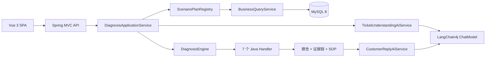
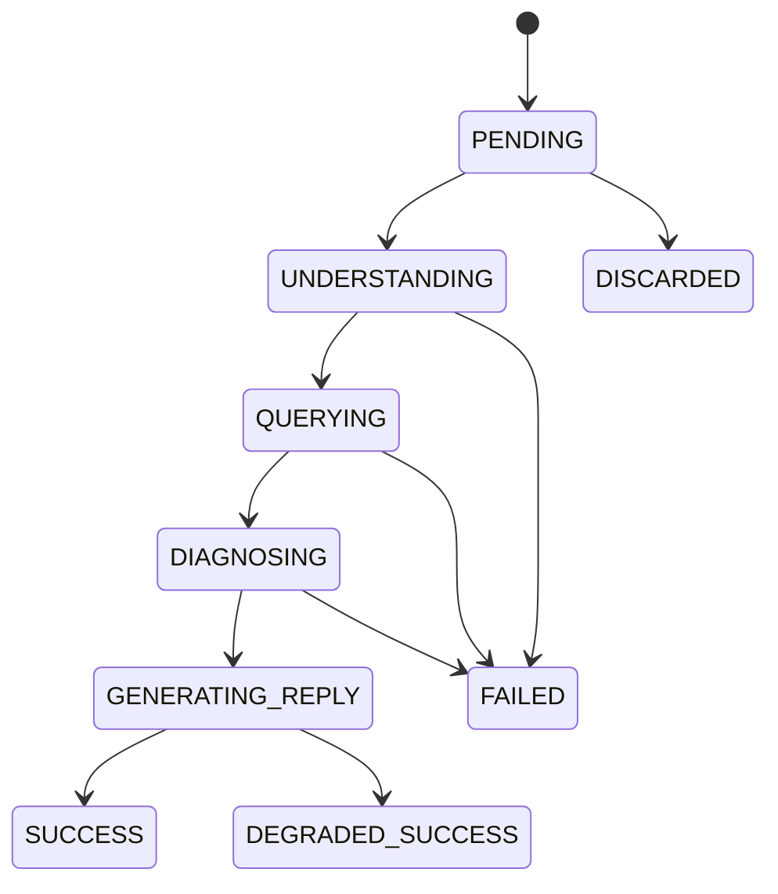

# SupportOps Agent 架构设计

## 1. 范围与版本

本项目是面向电商客服的可解释工单诊断平台。第一阶段只支持下表中的 7 个确定场景；AI 负责理解工单和润色回复，Java 规则负责查询业务事实、判定根因并生成证据链。

| 组件 | 冻结版本/约束 |
| --- | --- |
| Java | 21 |
| Spring Boot | 3.5.16 |
| LangChain4j | 1.18.0-beta28 |
| MyBatis-Plus | 3.5.17 |
| MySQL | 8.0+ |
| Vue | 沿用现有 Vue 3 + Vite + JavaScript |

版本不得使用 `LATEST`、动态范围或 SNAPSHOT。LangChain4j 使用 Spring Boot 3 对应的 `-spring-boot-starter`。

## 2. 核心链路



一次诊断最多调用模型两次。模型不能直接访问订单、支付、退款等数据，也不能返回任意 Java 类名或选择未注册工具。模型不可用时，已完成的规则诊断仍然有效，客服回复由模板生成，任务进入 `DEGRADED_SUCCESS`。

## 3. 场景白名单

| 场景名称 | `ScenarioType` | 确定性处理器 |
| --- | --- | --- |
| 支付成功但订单未更新 | `PAYMENT_SUCCESS_ORDER_PENDING` | `PaymentSuccessOrderPendingHandler` |
| 订单已取消但仍扣款 | `ORDER_CANCELLED_BUT_CHARGED` | `OrderCancelledButChargedHandler` |
| 优惠券无法使用 | `COUPON_UNAVAILABLE` | `CouponUnavailableHandler` |
| 会员权益未到账 | `MEMBER_BENEFIT_NOT_RECEIVED` | `MemberBenefitNotReceivedHandler` |
| 物流状态不同步 | `LOGISTICS_STATUS_NOT_SYNCED` | `LogisticsStatusNotSyncedHandler` |
| API 调用频繁失败 | `API_FREQUENT_FAILURE` | `ApiFrequentFailureHandler` |
| 发票开具失败 | `INVOICE_ISSUE_FAILED` | `InvoiceIssueFailedHandler` |

未知场景统一映射为 `UNKNOWN`，不得猜测根因。

## 4. 状态机



终态为 `SUCCESS`、`FAILED`、`DEGRADED_SUCCESS`、`DISCARDED`。只有模型相关失败允许降级成功；业务数据缺失、非法状态迁移和权限错误不得伪装为降级成功。

## 5. 模块化分层架构与依赖边界

项目参照《阿里巴巴 Java 开发手册》的分层和对象命名思想，但不采用会随业务增长而膨胀的全局 `controller/service/dao` 目录。当前采用模块化单体：一级目录先隔离领域，领域内部再严格分层。

```text
com.example.supportops
├── module
│   ├── auth
│   │   ├── controller
│   │   ├── service / service.impl
│   │   ├── manager
│   │   ├── dao
│   │   ├── model/{dto,bo,vo}
│   │   └── convert
│   ├── ticket
│   │   └── controller → service → manager → dao
│   ├── business
│   │   └── controller → service → dao + typed query model
│   ├── system
│   │   └── controller → service
│   └── diagnosis
│       └── model/enums
├── common
│   ├── exception
│   └── response
├── infrastructure
│   ├── security
│   └── web
└── config
```

### 5.1 为什么先分模块再分层

- 领域内聚：工单代码集中在 `module.ticket`，修改工单不会在多个全局目录间跳转。
- 控制增长：新增诊断、知识库等领域时，各自拥有内部层级，不会让全局 Controller 或 Service 目录无限膨胀。
- 限制耦合：业务模块禁止引用其他模块的内部包；跨模块协作必须通过后续定义的公开 Facade/API。
- 保留分层：模块化不是把代码重新堆进业务包，每个复杂模块内部仍维持单向依赖。

### 5.2 层级职责

```text
Controller  Web 协议、参数校验、HTTP 状态与统一响应
    ↓
Service     用例编排、业务规则、权限判断与事务边界
    ↓
Manager     可选；封装可复用原子能力、持久化组合与异常翻译
    ↓
DAO/Mapper  SQL、数据库映射和查询投影
```

Manager 不是强制层。认证与工单存在复用的数据访问和持久化规则，因此保留 Manager；业务快照是单纯只读查询，Service 直接访问 DAO，避免形成只做一次方法转发的空层。

### 5.3 对象边界

- `DTO`：Web 输入，例如 `LoginDTO`、`TicketCreateDTO`。
- `BO`：Service 与 Manager 之间的业务对象，不承担数据库映射。
- `DO`：数据库表对象，只存在于 DAO/Manager 边界内。
- `VO`：接口输出，Controller 禁止返回 DO。
- `Query Record`：复杂联表只读投影。每种业务查询具有明确 Java 类型，替代 `Map<String,Object>`。
- `Convert`：DTO、BO、DO、VO 的显式转换，禁止在 Controller 拼装数据库对象。

### 5.4 强制依赖规则

1. Controller 只能调用本模块 Service，不能访问 Manager、DAO、ServiceImpl 或 BO/DO。
2. Service 不能注入 Mapper、DO 或 `JdbcTemplate`；简单查询可调用本模块 DAO，复杂持久化能力调用 Manager。
3. Manager 不能依赖 Controller、Service、DTO 或 VO。
4. DAO 不包含业务判断，不能依赖 Controller、Service、Manager、DTO 或 VO。
5. `common`、`config`、`infrastructure` 不得反向依赖任何业务模块。
6. 一个业务模块不得引用另一个业务模块的内部包。
7. 禁止通配符 import；业务查询禁止 `Map<String,Object>`。

以上规则由 `LayeringArchitectureTests` 自动检查，违反边界会直接导致测试失败。

### 5.5 三类典型调用链

认证链路需要隐藏用户表结构并复用用户读取能力：

```text
AuthController
  → AuthService
    → UserManager
      → SupportUserMapper
        → support_users
```

工单链路包含事务、状态机、重复键翻译和分页持久化，因此使用完整分层：

```text
TicketController
  → TicketService（事务 + 状态迁移）
    → TicketManager（CRUD + 数据异常翻译）
      → TicketMapper
        → tickets
```

业务快照是只读联表查询，没有可复用写能力。为避免空转 Manager，使用简化链路：

```text
BusinessQueryController
  → BusinessQueryService（用例语义 + 不存在判断）
    → BusinessQueryDAO（SQL + RowMapper）
      → typed Query Record
```

### 5.6 事务和状态约束

- 事务边界位于 Service；Controller、Manager、DAO 不自行开启业务事务。
- Ticket 状态和优先级使用枚举，不再接收任意字符串。
- Ticket 状态迁移由领域枚举集中定义；非法迁移返回 `INVALID_STATUS_TRANSITION`。
- 数据库建表脚本同时增加状态和优先级 CHECK 约束，应用校验与数据库约束形成双层保护。
- 业务查询返回不可变列表和类型化 Record，避免调用方修改查询结果或依赖运行时 Map 键名。

### 5.7 当前取舍

- 保留单体部署，避免在业务规模尚小时引入分布式事务、服务发现和远程调用复杂度。
- Auth、Ticket 使用 Service 接口作为稳定用例边界；System、Business 只有单一内部实现，使用具体 Service，避免形式化的接口/实现文件对。
- 当前跨模块没有直接依赖。将来确需协作时，应增加模块公开 Facade，而不是导入对方 DAO、Manager 或内部模型。

## 6. 数据与安全边界

- API Key 只通过后端环境变量提供，不进入前端、Git、数据库或日志。
- 默认 Profile 为 `mock`，不要求 API Key；`real` 和 `prod` 使用 OpenAI-Compatible 配置。
- 完整 Prompt、模型回复、密码和令牌不得落日志。
- 所有响应携带 `requestId`；客户端传入合法 `X-Request-Id` 时沿用，否则服务端生成 UUID。
- 用户描述最多 2,000 字；数据库采用 UTF-8 MB4 和 UTC 时间语义，API 输出 ISO-8601 时间。

## 7. 部署视图

开发阶段前端由 Vite 提供，后端监听 `8080`；Mock Profile 使用内存数据源以保证骨架可独立启动。Real/Prod Profile 连接 MySQL 8，数据库结构和演示数据分别位于 `sql/schema.sql`、`sql/data.sql`。
