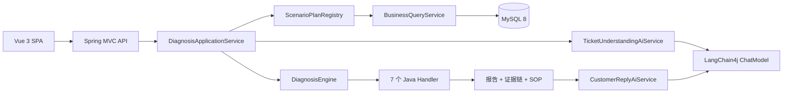
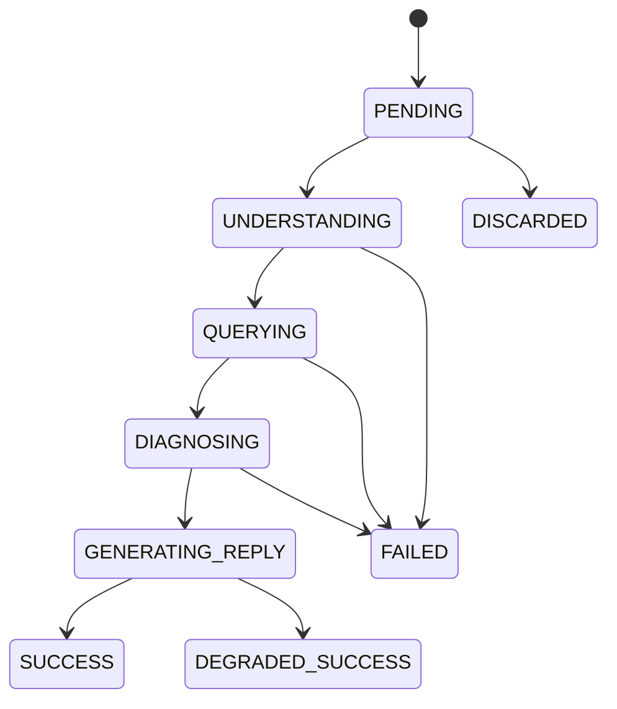

# SupportOps Agent 架构设计

## 1. 范围与版本

本项目是面向电商客服的可解释工单诊断平台。第一阶段只支持下表中的 7 个确定场景；AI 负责理解工单和润色回复，Java 规则负责查询业务事实、判定根因并生成证据链。

| 组件 | 冻结版本/约束 |
| --- | --- |
| Java | 21 |
| Spring Boot | 3.5.16 |
| LangChain4j | 1.18.0-beta28 |
| MyBatis-Plus | 3.5.17 |
| MySQL | 8.0+ |
| Vue | 沿用现有 Vue 3 + Vite + JavaScript |

版本不得使用 `LATEST`、动态范围或 SNAPSHOT。LangChain4j 使用 Spring Boot 3 对应的 `-spring-boot-starter`。

## 2. 核心链路

一次诊断最多调用模型两次。模型不能直接访问订单、支付、退款等数据，也不能返回任意 Java 类名或选择未注册工具。模型不可用时，已完成的规则诊断仍然有效，客服回复由模板生成，任务进入 `DEGRADED_SUCCESS`。

## 3. 场景白名单

| 场景名称 | `ScenarioType` | 确定性处理器 |
| --- | --- | --- |
| 支付成功但订单未更新 | `PAYMENT_SUCCESS_ORDER_PENDING` | `PaymentSuccessOrderPendingHandler` |
| 订单已取消但仍扣款 | `ORDER_CANCELLED_BUT_CHARGED` | `OrderCancelledButChargedHandler` |
| 优惠券无法使用 | `COUPON_UNAVAILABLE` | `CouponUnavailableHandler` |
| 会员权益未到账 | `MEMBER_BENEFIT_NOT_RECEIVED` | `MemberBenefitNotReceivedHandler` |
| 物流状态不同步 | `LOGISTICS_STATUS_NOT_SYNCED` | `LogisticsStatusNotSyncedHandler` |
| API 调用频繁失败 | `API_FREQUENT_FAILURE` | `ApiFrequentFailureHandler` |
| 发票开具失败 | `INVOICE_ISSUE_FAILED` | `InvoiceIssueFailedHandler` |

未知场景统一映射为 `UNKNOWN`，不得猜测根因。

## 4. 状态机

终态为 `SUCCESS`、`FAILED`、`DEGRADED_SUCCESS`、`DISCARDED`。只有模型相关失败允许降级成功；业务数据缺失、非法状态迁移和权限错误不得伪装为降级成功。

## 5. 模块边界

- `common`：统一响应、错误码、异常映射、requestId 与通用安全配置。
- `auth`：用户身份、JWT 登录与当前用户；Day 7 实现。
- `business`：订单、支付、退款、优惠券、会员、物流、API 和发票的只读查询。
- `diagnosis`：任务编排、场景计划、规则引擎、报告、证据与 SOP。
- `ai`：模型配置、两类 AI Service、调用监听和 Mock 实现。

## 6. 数据与安全边界

- API Key 只通过后端环境变量提供，不进入前端、Git、数据库或日志。
- 默认 Profile 为 `mock`，不要求 API Key；`real` 和 `prod` 使用 OpenAI-Compatible 配置。
- 完整 Prompt、模型回复、密码和令牌不得落日志。
- 所有响应携带 `requestId`；客户端传入合法 `X-Request-Id` 时沿用，否则服务端生成 UUID。
- 用户描述最多 2,000 字；数据库采用 UTF-8 MB4 和 UTC 时间语义，API 输出 ISO-8601 时间。

## 7. 部署视图

开发阶段前端由 Vite 提供，后端监听 `8080`；Mock Profile 使用内存数据源以保证骨架可独立启动。Real/Prod Profile 连接 MySQL 8，数据库结构和演示数据分别位于 `backend/sql/schema.sql`、`backend/sql/data.sql`。
